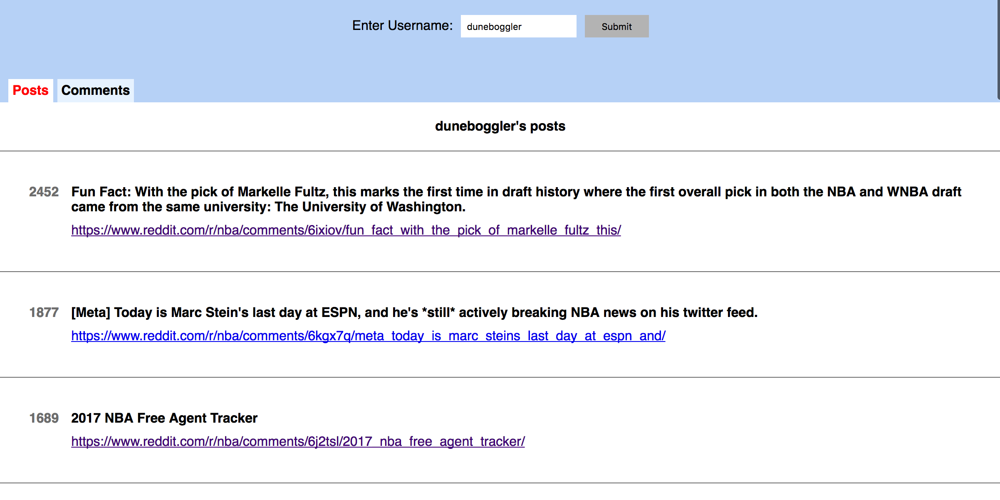

# Reddit User Info Coding Challenge Solution

**To see the app, run `yarn install` and then run `yarn start`.**

**To run the test suite, run `yarn test`.**

## Technologies Used
### Create React App

Because of the relatively short time-limit, this coding challenge was done using
the [create-react-app library](https://github.com/facebookincubator/create-react-app).

`create-react-app` allows users to quickly launch react projects without having
to deal with configuration. This can especially be helpful for timed 
coding challenges or if you're at an onsite, and they ask you to quickly build
an app.

**Caveat:** Some people might want to see that you are fluent in configuring a React app 
and may prefer you not using a library like `create-react-app`. It's a good
idea to first check with the interviewer or reviewer before using it.

Because this was my first time using create-react-app, here are a couple of good
resources (in addition to the official docs) that helped me get started quickly:
* [Quick tutorial](https://medium.com/@diamondgfx/learning-react-with-create-react-app-part-1-a12e1833fdc)
* [Resource that helped explain the blackbox of the react-scripts](https://www.fullstackreact.com/articles/using-create-react-app-with-a-server/)

### Axios 

For this project, I decided to use the [Axios library](https://github.com/mzabriskie/axios) 
to make ajax requests. 

[This](https://daveceddia.com/ajax-requests-in-react/) was a good resource that
offered a few options for making ajax requests and then gave a brief demo of axios.

## Considerations When Doing a Coding Challenge
There are several things to consider when doing a coding challenge. For this one,
we'll focus on 3 main considerations:
1. Coding style and modularity
2. Presentation
3. Tests

### Coding Style and Modularity

"Do I want this person contributing to my team's codebase?" is one of the key
considerations going through hiring managers' minds when they review your coding
challenge. 

1. Use a linter. One of the nice things about `create-react-app` is that they
actually already have `eslint` built into it so that if I run `eslint src/components --fix`,
it both shows me the style issues and autofixes some of them.
2. Keep code DRY. 
  * A potential area that I could have done better on here is potentially
refactoring the 2 `axios.get` executions into just one helper method. 
  * One area that I was able to make DRYer was the `shownInfo` method in `RedditUserInfo`.
  Initially, that method had a conditional that returned a similar-looking component
  in both cases. I was able to refactor them just one component that used shared props.
3. Put thought into project file structure. Since this is a smaller project, it
could be tempting to just throw all React code into one component, or all 
stylesheets into `App.css`. Again, always consider the readability of your code.

### Presentation

When under a time crunch, it could be easy to completely disregard styling. However,
especially if it is for a frontend role, you should put thought into the presentation
and styling of your app.

1. One thing that stood out to me about this app is that it would be holding a
total of 50 comments and posts. If I dumped all of that into just one index view,
it starts to feel cluttered and messy. Because of this, I decided to use tabs
to control which information was being displayed. 

2. I also decided to implement some basic error handling. User feedback is always
good, and you can highlight this in your project README for the reviewer.

3. Because the prompt stated that the CEO was a huge fan of reddit, I decided
to capture as much of the Reddit feel as I could, using similar colors and tab
design:

### Tests

As previously mentioned, even if it does not explicitly ask for it, you should
ALWAYS write tests for your coding challenge whenever appropriate. 

In this case, again the time was potentially a huge constraint in us writing 
test cases. Some quick thoughts: 

1. If you're pressed for time in writing tests for React apps, consider writing
[snapshot tests](https://facebook.github.io/jest/docs/snapshot-testing.html).
2. Continue to think about file structure and modularity even in your test cases.
For example, in this project, I went ahead and created a testUtils directory that
held some test variables that I might later want to use in other tests.
